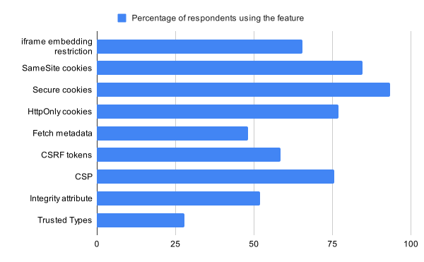
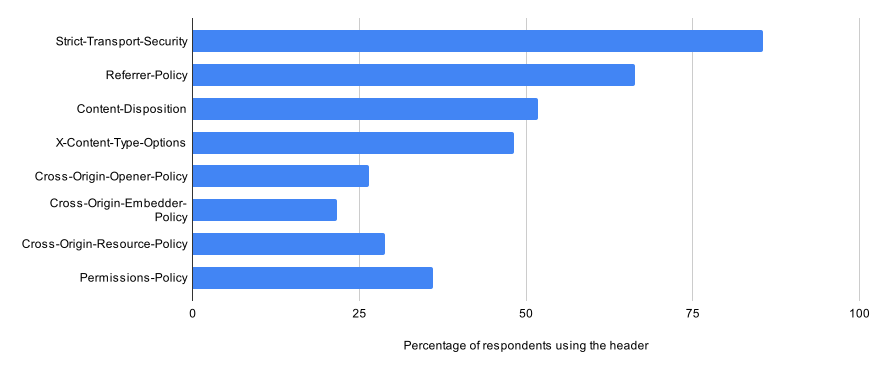

# SWAG Web Security survey 2025

The W3C Security Application Guidelines Community Group (SWAG CG) develops and publishes [recommendations to help web developers secure their applications](https://github.com/w3c-cg/swag/blob/main/docs/security_guidelines.md).

We wanted to understand whether web developers are using the features that we recommend, so in 2025/2026 we ran a survey that asked web developers to tell us which features they used.

## Respondents

We asked for respondents through social media channels belonging to the W3C and individuals connected with SWAG CG. We had 108 responses in total. Respondents skewed very experienced:

- 61% had more than 10 years of web development experience
- 62% rated their general web development knowledge as "expert"
- 70% rated their web security knowledge as "intermediate", 18% as "expert"

We also asked respondents whether they were responsible themselves for securing their sites, or whether they delegated to security specialists: 77% of respondents told us that they were responsible for security themselves.

## Responses

The questions we asked fall into two groups:

- A series of yes/no questions, asking whether developers used any of a number of features.
- A question asking which of a number of HTTP headers the respondent uses.

### Web security features

We asked web developers:

> - Do you implement any mechanism to control whether third-party sites can embed your site as an iframe?
>
> - When you set cookies that contain a user's login credentials (such as a session ID), do you set the SameSite attribute to "Lax" or "Strict", to control whether the cookie is included in cross-site requests?
>
> - When you set cookies that contain sensitive user information (such as a session ID), do you set the Secure attribute to ensure they are only sent over an encrypted (HTTPS) connection?
>
> - When you set cookies, do you use the HttpOnly attribute to prevent them from being accessed by client-side JavaScript?
>
> - Do you use Fetch metadata to control whether certain cross-site requests are allowed?
>
> - Do you use CSRF tokens in forms on your site?
>
> - Do you use a Content-Security-Policy header on your site?
>
> - Do you set the "integrity" attribute on scripts you load from a third-party site such as a CDN?
>
> - Do you enforce the use of Trusted Types when passing input into JavaScript injection sinks such as innerHTML?

We've summarised the results in the following table:

Adoption of [security-related cookie attributes](https://developer.mozilla.org/en-US/docs/Web/Security/Practical_implementation_guides/Cookies) is high. We might expect more adoption of [`SameSite`](https://developer.mozilla.org/en-US/docs/Web/HTTP/Reference/Headers/Set-Cookie#samesitesamesite-value) for cookies containing session IDs, since this is widely recommended as a defense in depth against cross-site attacks including CSRF, clickjacking, and some cross-site leaks.

Adoption of [CSP](https://developer.mozilla.org/en-US/docs/Web/HTTP/Guides/CSP) is higher than we expected at about 75%. In particular, it's much higher than the 21.9% recorded by the [Web Almanac in 2025](https://almanac.httparchive.org/en/2025/security#content-security-policy).

The least-used feature we asked about was [trusted types](https://developer.mozilla.org/en-US/docs/Web/API/Trusted_Types_API), which saw only a little more than 25% adoption: perhaps this is not surprising as it has only recently gained cross-browser support.

The only other feature to be used by less than 50% of respondents was fetch metadata. Fetch metadata is an ergonomic and very useful API, and has been supported in most browsers for several years. However, until recently, documentation of it in both OWASP and MDN has been lacking: so we might speculate that lack of adoption results from a lack of awareness.

Only a little over 50% of respondents used the `integrity` attribute (also known as [Subresource Integrity (SRI)](https://developer.mozilla.org/en-US/docs/Web/Security/Defenses/Subresource_Integrity)): this might reflect the fact that SRI is only relevant for websites that use resources hosted on a different site. This is definitely a case where it would be helpful to have more insight into the reasons developer have for the choices they make.

### HTTP headers

We asked web developers which of the following HTTP headers they use:

- [Strict-Transport-Security (HSTS)](https://developer.mozilla.org/en-US/docs/Web/HTTP/Reference/Headers/Strict-Transport-Security)
- [Referrer-Policy](https://developer.mozilla.org/en-US/docs/Web/HTTP/Reference/Headers/Referrer-Policy)
- [X-Content-Type-Options](https://developer.mozilla.org/en-US/docs/Web/HTTP/Reference/Headers/X-Content-Type-Options)
- [Content-Disposition](https://developer.mozilla.org/en-US/docs/Web/HTTP/Reference/Headers/Content-Disposition)
- [Cross-Origin-Embedder-Policy (COEP)](https://developer.mozilla.org/en-US/docs/Web/HTTP/Reference/Headers/Cross-Origin-Embedder-Policy)
- [Cross-Origin-Opener-Policy (COOP)](https://developer.mozilla.org/en-US/docs/Web/HTTP/Reference/Headers/Cross-Origin-Opener-Policy)
- [Cross-Origin-Resource-Policy (CORP)](https://developer.mozilla.org/en-US/docs/Web/HTTP/Reference/Headers/Cross-Origin-Resource-Policy)
- [Permissions-Policy](https://developer.mozilla.org/en-US/docs/Web/HTTP/Reference/Headers/Permissions-Policy)

We can summarise the results as follows:

The most-used header here is `Strict-Transport-Security`, at 85%, but we might expect it to be even more widely used: it's recommended in almost all cases and checked for in Mozilla's [HTTP Observatory](https://developer.mozilla.org/en-US/observatory/docs/tests_and_scoring#tests_and_score_modifiers).

It is also surprising `X-Content-Type-Options` is used by less than half our respondents: it is always recommended and is also checked for in the Observatory.

## Uncovering the reasons

If a developer doesn't use a feature, it might be for a variety of reasons:

- The feature isn't applicable to their use case
- The feature is too difficult to use
- The developer doesn't know about the feature
- The developer doesn't understand how to use it

Without understanding what the reasons are, it's hard for us to know what, if anything, we could do to encourage adoption of a feature.

We were aware of this limitation before running the survey and asked respondents if they would be willing to participate in an interview in which we could dig deeper. However, we didn't get enough volunteers for this to be effective. If you're reading this and would like to talk to us, we'd still be very happy to talk you!

## Our findings

### Web developers need security documentation

Our respondents were almost all generalist web developers: less than 5% described themselves as security specialists, and only 18% described their web security knowledge as "expert".

However, more than three quarters of them reported that they were responsible themselves for implementing security features and practices, rather than delegating to specialists.

This supports our belief, in SWAG CG, that we need web security documentation that is accessible to generalist web developers. It's not enough to present web security as a separate field: although it's great to have specialist security documentation that explores the domain in depth, we also need documentation, aimed at all web developers, to introduce the issues, provide context, and describe the relationship between the features that web developers need to implement and the security considerations that apply to them.

### Deeper insights are needed

In this survey we've only asked developers which features they use. But if a developer doesn't use a feature, it might be for a variety of reasons:

- The feature isn't applicable to their use case
- The feature is too difficult to use
- The developer doesn't know about the feature
- The developer doesn't understand how to use it

Without understanding what the reasons are, it's hard for us to know what, if anything, we could do to encourage adoption of a feature.

We were aware of this limitation before running the survey and asked respondents if they would be willing to participate in an interview in which we could dig deeper. However, we didn't get enough volunteers for this to be effective. If you're reading this and would like to talk to us, we'd still be very happy to talk to you!

### Missing content

Even given the limitation we've just discussed, the survey suggests some documentation gaps.

In particular, as we've noted, it's plausible that the relatively low adoption of fetch metadata is related to a lack of awareness. Until last year, fetch metadata was not well documented on MDN or OWASP. This situation has recently been improved: OWASP now lists fetch metadata as a [defense against CSRF](https://cheatsheetseries.owasp.org/cheatsheets/Cross-Site_Request_Forgery_Prevention_Cheat_Sheet.html#fetch-metadata-headers), and MDN describes its use against both [CSRF](https://developer.mozilla.org/en-US/docs/Web/Security/Attacks/CSRF#fetch_metadata) and [cross-site leaks](https://developer.mozilla.org/en-US/docs/Web/Security/Attacks/XS-Leaks#fetch_metadata). However, MDN should also have a standalone guide to fetch metadata on MDN, to go alongside guides on other [defenses](https://developer.mozilla.org/en-US/docs/Web/Security/Defenses) such as [Subresource Integrity](https://developer.mozilla.org/en-US/docs/Web/Security/Defenses/Subresource_Integrity) and [TLS](https://developer.mozilla.org/en-US/docs/Web/Security/Defenses/Transport_Layer_Security).

## Thanks

Thanks to all the members of SWAG CG who helped shape this survey, everyone who helped publicise it, and, especially, to everyone who took the time to respond.
